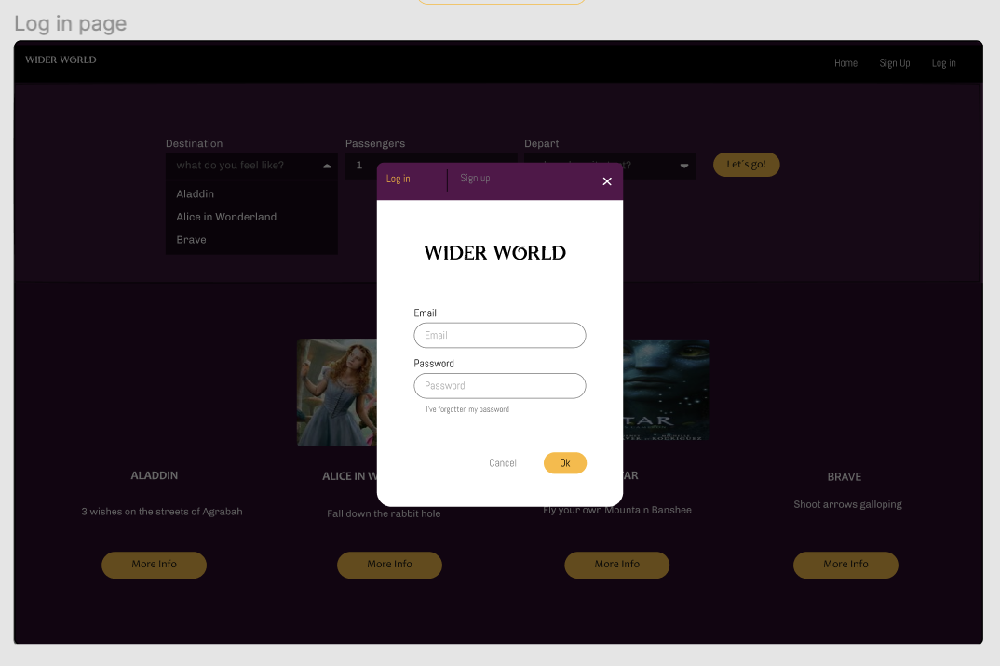
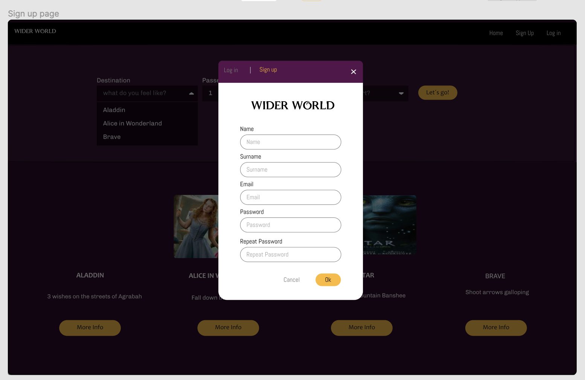
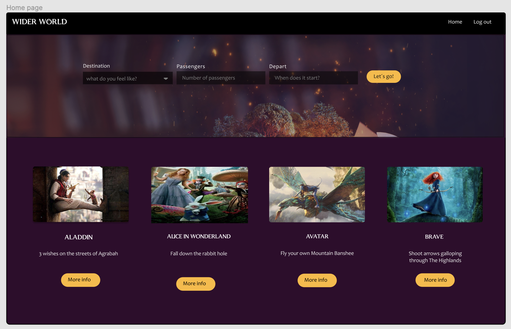
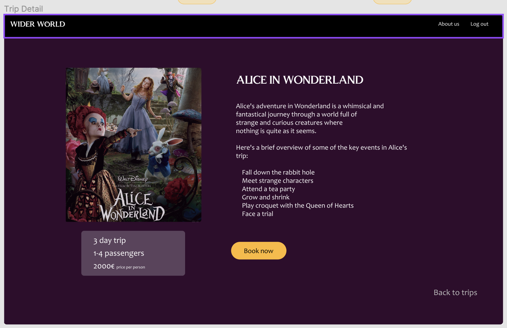
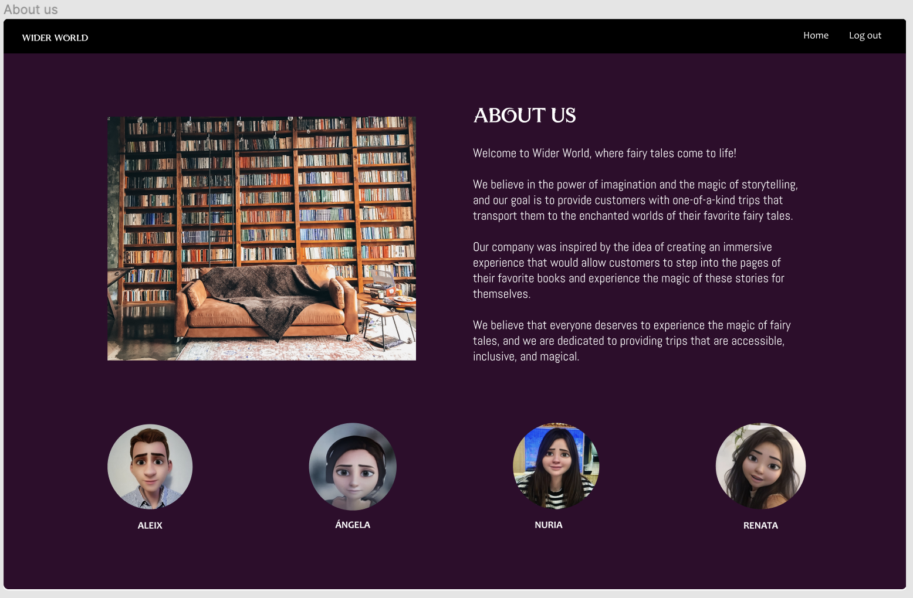
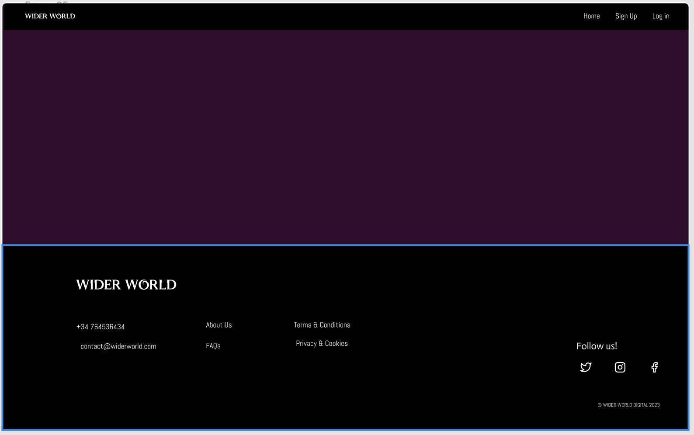

# Wider World

## Descripción del proyecto

Wider World és una web donde poder encontrar viajes mágicos a destinos encantados inspirados en tus cuentos de hadas favoritos, como Avatar, Brave, Aladino y Alicia en el País de las Maravillas. 

Nuestros viajes están diseñados para los entusiastas de los cuentos de hadas que quieren experimentar la maravilla y la magia de estas queridas historias en la vida real.

## 3 Descripción imagenes y url de los mockups

Los mockups estan disponibles en las siguiente url: **https://www.figma.com/file/IVDZ2hCrpoKFsNMCIZHQ77/Simple-Wireframe-Kit?type=design&node-id=749-2085&t=N1a5PdG6Q3ZBy42R-0**

### Hero

Página de presentación de la página web.

 

### Log in

Tener la opción de crear una cuenta personal i acceder como usuario registrado.

 

### Sign Up

Un inicio de sesión en mi cuenta para poder entrar en mi perfil.

### Password recovery

Una ventana donde poder restaurar mi contraseña y recuperar el acceso a mi cuenta.

 

### Home

La página donde ver los viajes que se ofertan
para elegir en función a mis intereses.

 

### Trip Details

Un espacio para ver los la información y detalles de los viajes que se ofertan y ver si se alinean con mis intereses.

 

### About us

Un espacio para dar a conocer la visión y los valores de los integrantes del proyecto.

  

### Contact & Info

Un footer que contenga información relevante y enlaces de interés(Contacto, Redes Sociales…).

  

## 4 Tecnologías en el desarrollo

Hemos utilizado Figma, VSCode como herramientas de diseño y desarrollo y HTML5, CSS y Javascript para la creación de la página.

## 5 Retos enfrentados y características que se esperan desarrollar en el futuro

Nos hemos enfrentado a:

- Elección del tema, así como el diseño y distribución de la pàgina web y sus distintas ramas.
- Desarrollo del wireframe tanto en Figma como a código posteriormente. 
- Instalación de fuentes y dar efectos.
- Prototipado y ajuste en diferentes dispositivos.

Características que se esperan desarrollar en el futuro:

- Mejorar las funcionalidades existentes
- Implementar el CRUD
- Conectarlo a una base de datos

## 6 Url de la aplicación desplegada
**https://wider-world.vercel.app/#**

